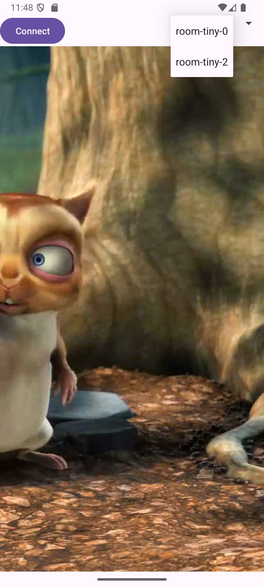

# LiveKit Android UI

# General

This is a sample Android app that demonstrates how to use the LiveKit Android SDK to build a video
viewer application.

# Features

- Get a token from the server via REST API
- Connect to LiveKit server
- Join a room
- Select a track from the room

# Screenshots



# LiveKit Android SDK

in [libs.versions.toml](gradle/libs.versions.toml)

```toml
[versions]
livekitAndroid = "2.12.3"

[libraries]
androidx-appcompat = { group = "androidx.appcompat", name = "appcompat", version.ref = "appcompat" }
```

in [settings.gradle.kts](settings.gradle.kts)

```kotlin
dependencyResolutionManagement {
    repositoriesMode.set(RepositoriesMode.FAIL_ON_PROJECT_REPOS)
    repositories {
        google()
        mavenCentral()
        maven("https://jitpack.io")
        maven("https://livekit.io")
    }
}
```

